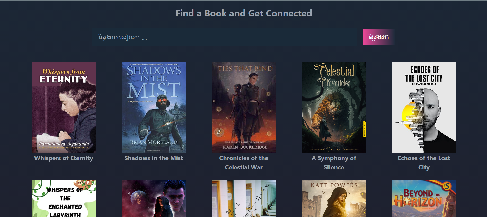

# Skoolio (A place where students can be able to download electronic books as PDF file) .

+ Target users : University and highschool students whoose difficult to find resources for self learning . Skoolio allows all users who has interest of sharing knowledge , education to upload their source to the platform .

__Features__
- Insert books
- Be available to download by other users
- Book owner dashboard
- Login / Register : Users are allowed to sign up with Google account or directly sign up with their email and password .
- hompage : List all books that currently have in the platform .
- Role and Permission : Only book owners are allowed to delete and update the book that are published .
- User friendly interface .


__Technologies & tools__
- React.JS (Frontend)
- Firebase : Cloud firestore , Firebase authentication , Firebase storage 
- TailwindCSS : Shadcn UI , Daisy UI 
- Vercel : Hosting platform , Firebase hosting .
- Figma : UI design platform 
- Postman : An (ADE) API Development Environment for develope and test APIs .

__GitHub Repository__
[https://github.com/Leap-Chanvuthy/Schoolio.git]


__Project Installation__

   -  Change directory to schoolio folder : ```cd Schoolio```
   -  Install neccessary dependencies : ```npm install```
   -  Start sever development environment : ```npm run dev```
   -  App is ran on ````https://localhost:5173/```

__Home Page__


